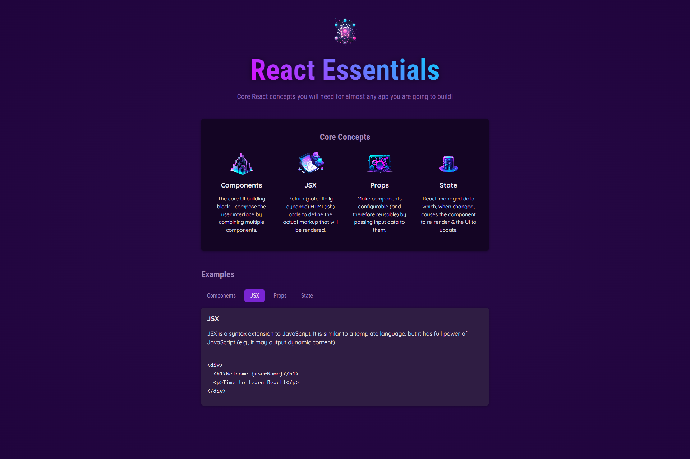

# Starting project React essentials - React Course by Maximilian Schwarzmüller

First project built with React following the Udemy React Course:
_React - The Complete Guide 2024 (incl. Next.js, Redux)._

By Academind, Instructor - Maximilian Schwarzmüller

[Link to Udemy Course](https://www.udemy.com/course/react-the-complete-guide-incl-redux/)

This project is a simple React app that demonstrates core concepts such as components, state, and event handling. The app allows users to interact with the UI, dynamically updating content based on user input.

## What I learnt

Realizing this project I learnt some core concepts about React, including:

- **Components and JSX**: Building user interfaces by creating reusable components and understanding JSX, a syntax extension for JavaScript that allows writing HTML-like code within JavaScript.
- **Props**: Passing data between components to make them more dynamic and reusable.
- **State Management**: Using React's `useState` hook to manage and update state, which is essential for building interactive UIs.
- **Event Handling**: Handling user events like clicks to dynamically update the UI.
- **Component Reusability**: Structuring components to be modular and reusable across different parts of the application.
- **Dynamic Data**: Using and sharing data dynamically between components and rendering it in the UI.
- **File Organization**: Organizing files and directories in a React project for better maintainability.

This project allowed me to understand how React works under the hood and equipped me with the essential knowledge to continue building more complex applications with React in the future.

## Screenshot



## Tech stack

- **HTML**: Base page structure
- **CSS**: Styling for the components.
- **JavaScript (ES6+)**: Logic and interactivity.
- **React JS**: Building user interfaces with components.

## Requirements

- **Node.js** (I used the v22.6.0 version)
- **Code Editor** like VS Code

## Installation

1. Clone the repository

```bash
git clone https://github.com/luigitarallo/starting-project-react-course.git
```

2. Install dependencies

```bash
npm install
```

3. Run the dev server

```bash
npm run dev
```

The app will be available at `http://localhost:5173/`
